---
## Front matter
lang: ru-RU
title: Лабораторная работа №2
subtitle: Первоначальна настройка git
author: 
  - Дзаки Рафли Зайдан
institute:
  - Российский университет дружбы народов, Москва, Россия
date: 2.03.2024

## Formatting pdf
toc: false
toc-title: Содержание
slide_level: 2
aspectratio: 169
section-titles: true
theme: metropolis
header-includes:
 - \metroset{progressbar=frametitle,sectionpage=progressbar,numbering=fraction}
 - '\makeatletter'
 - '\beamer@ignorenonframefalse'
 - '\makeatother'
## I18n polyglossia
polyglossia-lang:
  name: russian
  options:
        - spelling=modern
        - babelshorthands=true
polyglossia-otherlangs:
  name: english
## I18n babel
babel-lang: russian
babel-otherlangs: english
## Fonts
mainfont: PT Serif
romanfont: PT Serif
sansfont: PT Sans
monofont: PT Mono
mainfontoptions: Ligatures=TeX
romanfontoptions: Ligatures=TeX
sansfontoptions: Ligatures=TeX,Scale=MatchLowercase
monofontoptions: Scale=MatchLowercase,Scale=0.9

---

# Информация

## Докладчик

:::::::::::::: {.columns align=center}
::: {.column width="70%"}

  * Дзаки Рафли Зайдан
  * студент группы  НБИбд-01-23
  * Российский университет дружбы народов

:::
::: {.column width="30%"}

:::
::::::::::::::
# Цели и задачи работы

## Цели и задачи

Изучить идеологию и применение средств контроля версий.Освоить умения по работе с git.

# Процесс выполнения лабораторной работы

## Базовая настройка git:

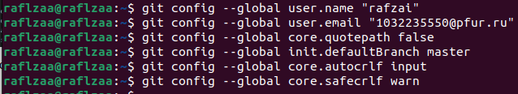{#fig:001 width=70%}

## Создаём ключ SSH и GPG.

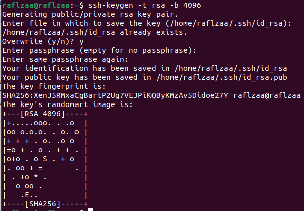{ #fig:002 width=70% }
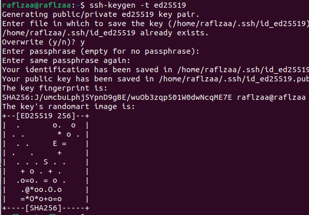{ #fig:003 width=70% }

## Ключ нужно добавить на github. Для этого переходим на сайте в раздел “Settings” и выбираем “SSH and GPG keys”.

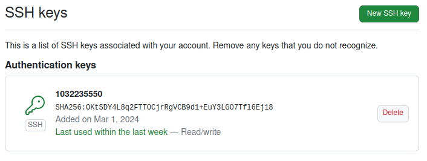{ #fig:004 width=70% }
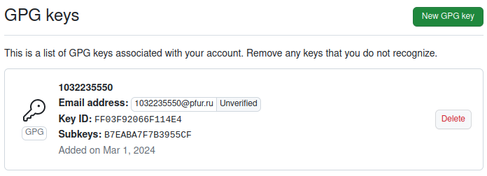{ #fig:005 width=70% }

## Выводим список ключей и копируем отпечаток приватного ключа

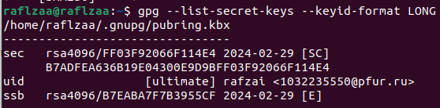{ #fig:006 width=70% }

## Настройка автоматических подписей коммитов git

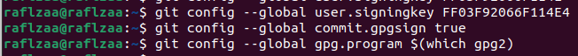{ #fig:007 width=70% }

## Возвращаемся в наш терминал и настраиваем gh.

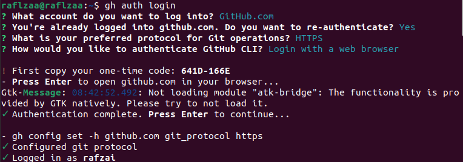{ #fig:008 width=70% }

## Создаём репозиторий курса на основе шаблона.

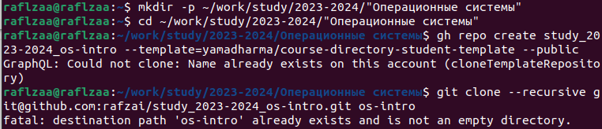{ #fig:009 width=70% }

## Настраиваем каталог курса.

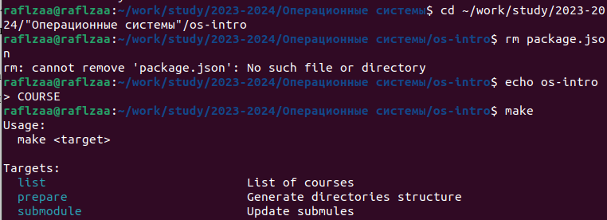{ #fig:010 width=70% }

## Создаём необходимые каталоги и отправляем наши файлы на сервер	

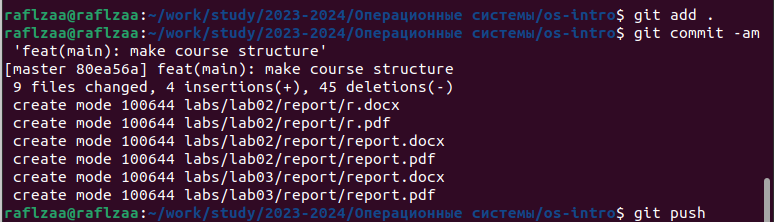{ #fig:011 width=70% }

## Вывод

В ходе выполнения лабораторной работы изучили идеологию и применение средств контроля версий, а также освоили умения по работе с git.
