---
## Front matter
lang: ru-RU
title: Лабораторная работа №2
subtitle: Первоначальна настройка git
author: 
  - Дзаки Рафли Зайдан
institute:
  - Российский университет дружбы народов, Москва, Россия
date: 2.03.2024

## Formatting pdf
toc: false
toc-title: Содержание
slide_level: 2
aspectratio: 169
section-titles: true
theme: metropolis
header-includes:
 - \metroset{progressbar=frametitle,sectionpage=progressbar,numbering=fraction}
 - '\makeatletter'
 - '\beamer@ignorenonframefalse'
 - '\makeatother'
## I18n polyglossia
polyglossia-lang:
  name: russian
  options:
        - spelling=modern
        - babelshorthands=true
polyglossia-otherlangs:
  name: english
## I18n babel
babel-lang: russian
babel-otherlangs: english
## Fonts
mainfont: PT Serif
romanfont: PT Serif
sansfont: PT Sans
monofont: PT Mono
mainfontoptions: Ligatures=TeX
romanfontoptions: Ligatures=TeX
sansfontoptions: Ligatures=TeX,Scale=MatchLowercase
monofontoptions: Scale=MatchLowercase,Scale=0.9

---

# Информация

## Докладчик

:::::::::::::: {.columns align=center}
::: {.column width="70%"}

  * Дзаки Рафли Зайдан
  * студент группы  НБИбд-01-23
  * Российский университет дружбы народов

:::
::: {.column width="30%"}

:::
::::::::::::::

# Цели и задачи работы

## Цели и задачи

Приобретение практических навыков взаимодействия пользователя с системой по-
средством командной строки

# Процесс выполнения лабораторной работы

## Определим полное имя вашего домашнего каталога.

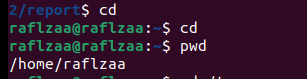{#fig:001 width=70%}

## Перейдём в каталог /tmp

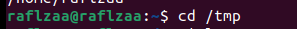{#fig:002 width=70%}

## Выведем на экран содержимое каталога /tmp с помощью команды ls

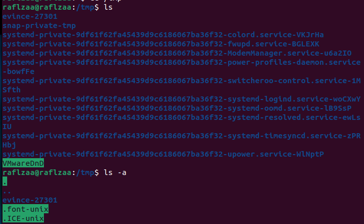{#fig:003 width=70%}

## Сравним команды ls -a и ls -F

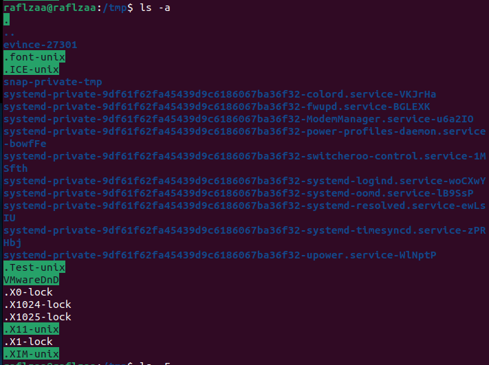{#fig:004 width=70%}
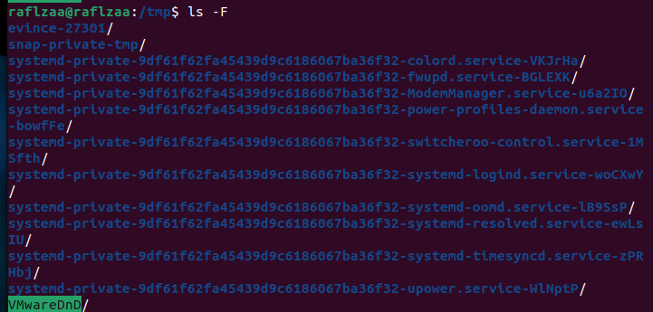{#fig:005 width=70%}
## Определим, есть ли в каталоге /var/spool подкаталог с именем cron

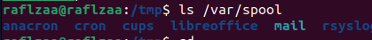{#fig:006 width=70%}

## Переходим в домашний каталог

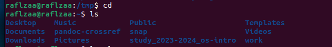{#fig:007 width=70%}

## Определим, кто является владельцем файлов и подкаталогов с помоью команды ls -l

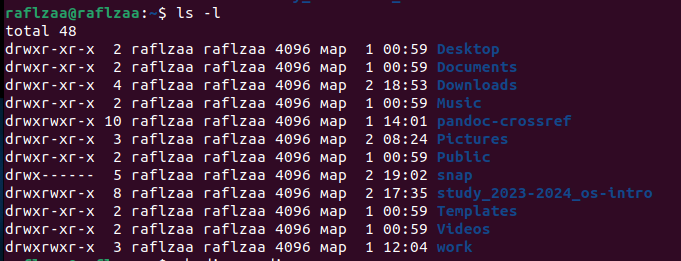{#fig:008 width=70%}

## В домашнем каталоге создаём новый каталог с именем newdir.

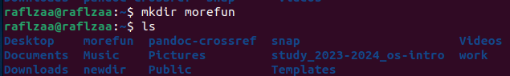{#fig:009 width=70%}

## В каталоге ~/newdir создаём новый каталог с именем morefun.

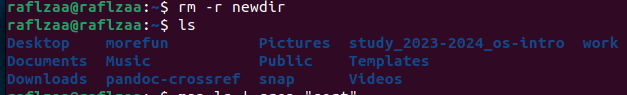{#fig:010 width=70%}

## Cоздаём одной командой три новых каталога с именами

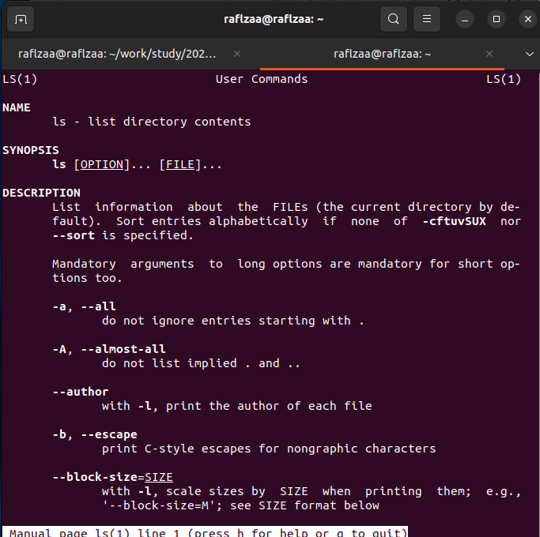{#fig:011 width=70%}

##

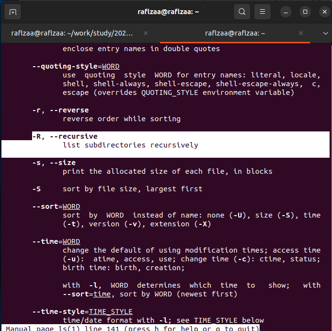{#fig:012 width=70%}

##

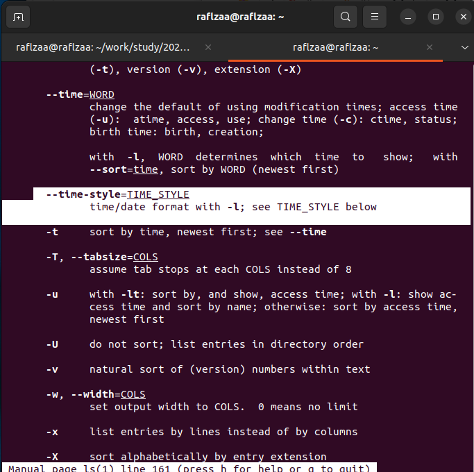{#fig:013 width=70%}

##

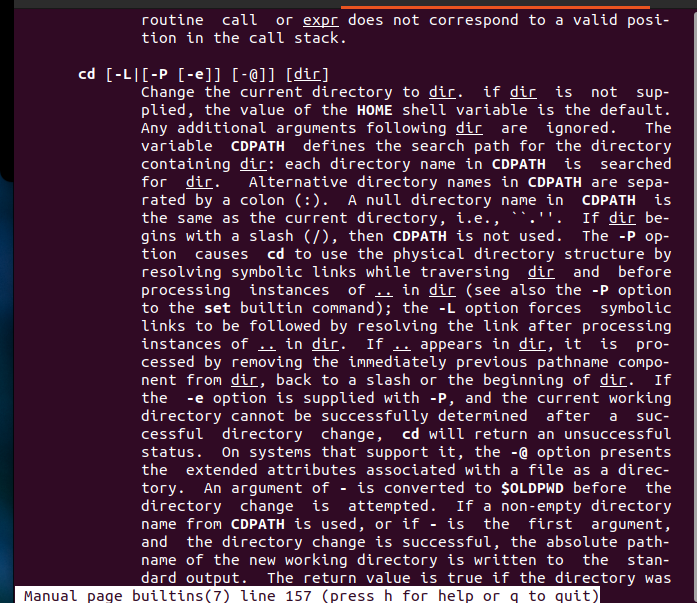{#fig:014 width=70%}

##

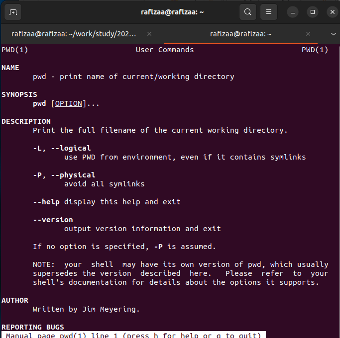{#fig:015 width=70%}

##

{#fig:016 width=70%}

##

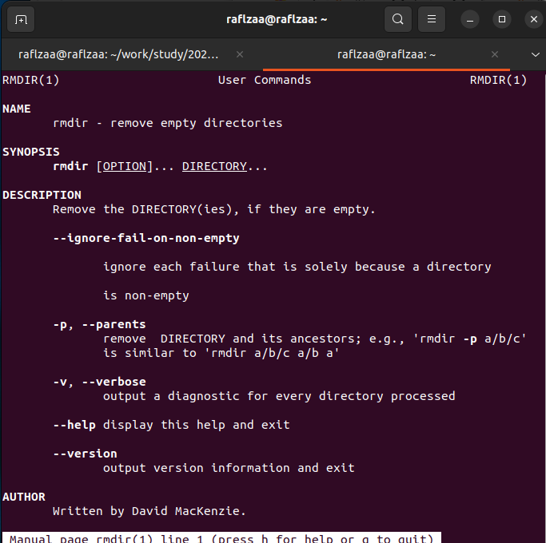{#fig:017 width=70%}

##

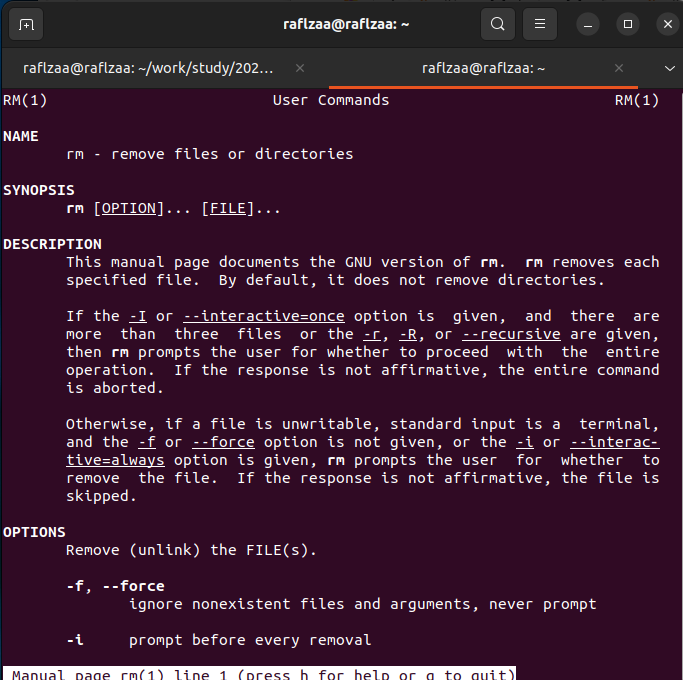{#fig:018 width=70%}

##

{#fig:019 width=70%}

## Получим при помощи команды history

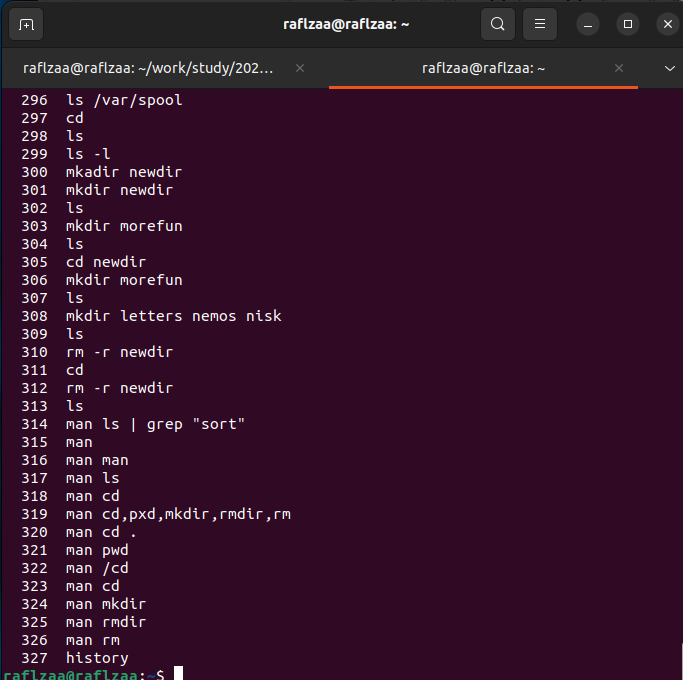{#fig:020 width=70%}
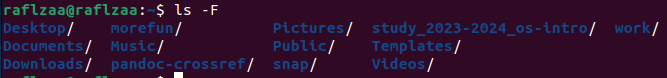{#fig:021 width=70%}

## Выполним модификацию и исполнение нескольких команд из буфера команд

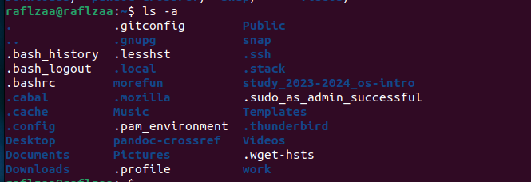{#fig:022 width=70%}

## Выводы

Мы приобрели практические навыки взаимодействия пользователя с системой по-
средством командной строки.
